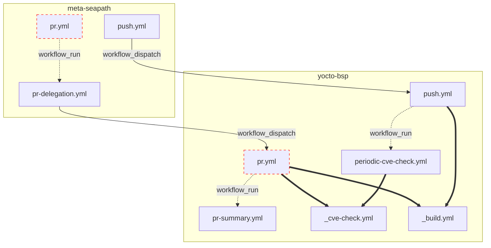

<!-- DON'T move this file up in .github otherwise it will be shown in the repository front page. -->

# CI/CD documentation

In order to centralize the CI on this repository, the CI on meta-seapath is redirected here via `workflow_dispatch` actions.

## Runner pools

Self-hosted runners are selected by label:

- `runner-sfl-seapath`: legacy pool.
- `runner-sfl-seapath-2`: pool provisioned by the `ci-runner-installer` repository (Fedora CoreOS, podman, persistent Yocto cache).

Pull request builds are dispatched across **both** pools (round-robin per image flavor, see `_build.yml`) so they build in parallel. Both pools therefore execute potentially unsafe fork code; this is an accepted tradeoff for CI throughput. In particular, untrusted PR code running on `runner-sfl-seapath-2` can tamper with its persistent Yocto cache and plant persistence on the machine: treat both pools as exposed, never grant tokens beyond the minimum documented per workflow, and keep the S3 release secrets confined to `build-and-s3-upload.yml`.

Each label must be registered by exactly one runner instance: `_build.yml` assumes it to serialize the flavor builds per machine.

Push and release builds (`push.yml`, `build-and-s3-upload.yml`) run exclusively on `runner-sfl-seapath-2`. Keep this routing intact when adding workflows or runners.

## Diagram

The red stroked boxes are the workflows that can potentially run in the context of an external contributor's PR. Those workflows are ran unprivileged: no secrets, read-only token (see https://docs.github.com/en/actions/reference/workflows-and-actions/events-that-trigger-workflows#workflows-in-forked-repositories).

Since we sometimes need secrets (e.g. to dispatch workflows) we circumvent this issue by chaining them to privileged workflows using `workflow_run` trigger. We need to be extra careful not to leak secrets in workflows that execute potential unsafe user code, thus **only the specific permissions should explicitely be set**.

